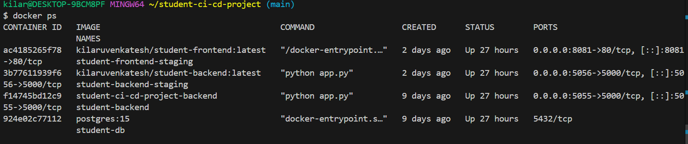
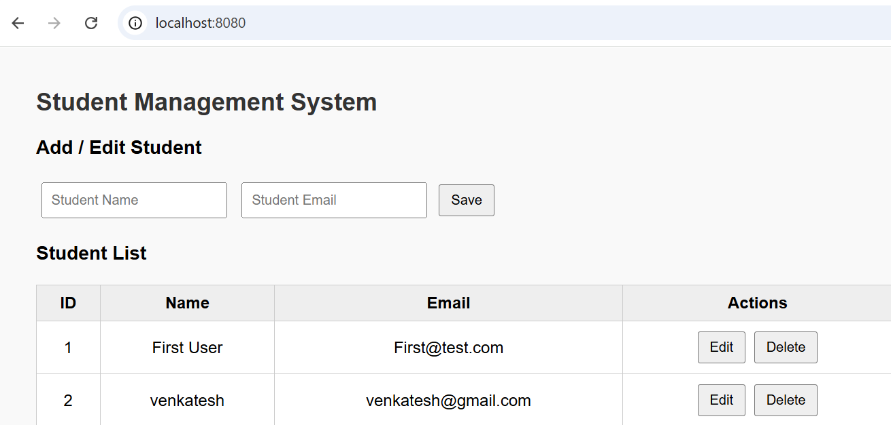
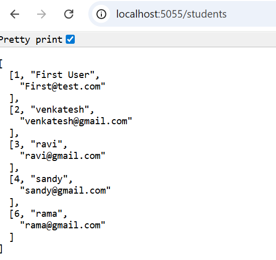
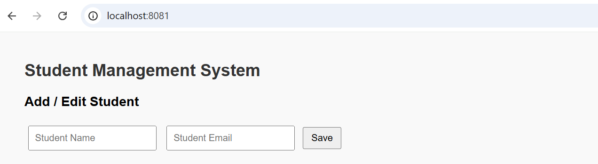
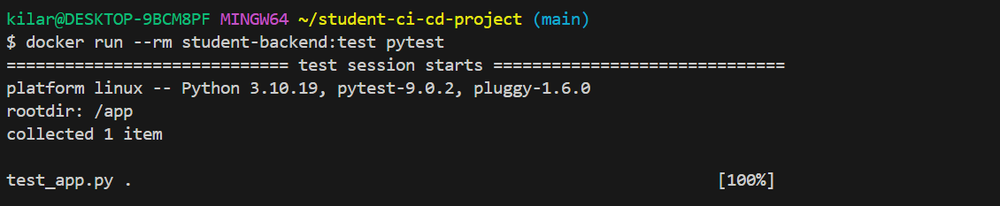
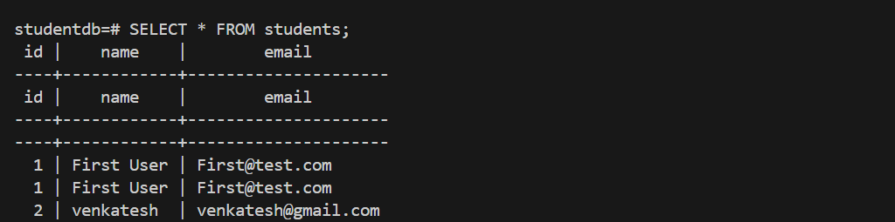
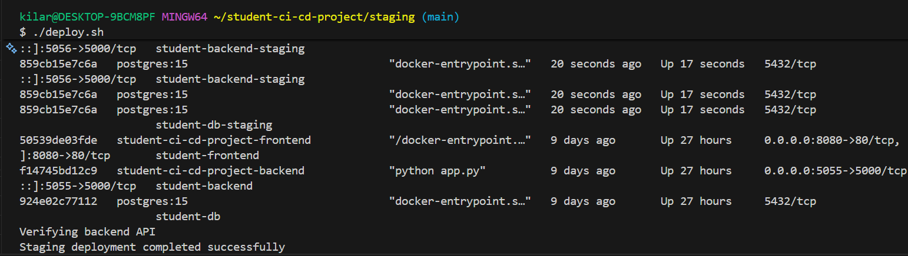

CI CD Enabled Capstone Project Student Management System

Overview:

This repository contains a containerized web application with a fully automated CI CD pipeline.
The solution demonstrates modern DevOps practices by integrating application development, containerization, automated testing, security scanning, and staged deployment.

The primary objective of this project is to showcase how a production-ready CI CD workflow can be implemented using Docker and GitHub Actions.
docker run --rm student-backend:test pytest

Business Context

In enterprise environments, manual builds and deployments introduce risk, inconsistency, and delays.
This project addresses those challenges by implementing automation that ensures consistent builds, early defect detection, and controlled deployments.

Application Summary:

The application is a Student Management System designed to manage student records through a web interface.

It consists of the following services.

-Frontend service providing the user interface
-Backend service exposing REST APIs
-Database service responsible for persistent storage

Each service is deployed independently using Docker containers.

Technology Stack:

Frontend technologies include HTML, CSS, and JavaScript
Backend service is implemented using Python and Flask
Database layer uses PostgreSQL
Containerization is implemented using Docker and Docker Compose
CI CD automation is implemented using GitHub Actions
Container security scanning is performed using Trivy

Technology Stack:

Frontend technologies include HTML, CSS, and JavaScript
Backend service is implemented using Python and Flask
Database layer uses PostgreSQL
Containerization is implemented using Docker and Docker Compose
CI CD automation is implemented using GitHub Actions
Container security scanning is performed using Trivy

Architecture Overview:

The frontend communicates with the backend through HTTP APIs.
The backend processes requests and interacts with the PostgreSQL database.
The database persists data using Docker volumes to ensure durability.

All services communicate through an isolated Docker network to ensure security and separation of concerns.

Local Development Setup:

Clone the repository from the source control system.

git clone https://github.com/kilaruvenkatesh/student-ci-cd-project.git

Navigate to the project directory.

cd student-ci-cd-project

Start all application services using Docker Compose.

docker compose up -d

Verify that all containers are running.

docker ps

Access the frontend application using a web browser.

http://localhost:8080

Validate backend API availability.

curl http://localhost:5055/students

Staging Environment Deployment:

The staging environment simulates a pre-production setup and is used to validate application behavior after CI CD execution.

Navigate to the staging directory.

cd staging

Execute the automated deployment script.

bash staging/deploy.sh /

Confirm that all staging services are running.

CI CD Pipeline Description:

The CI CD pipeline is triggered automatically on code changes pushed to the main branch.

The pipeline performs the following operations.

Docker images for application services are built
Backend unit tests are executed within containers
Docker images are scanned for security vulnerabilities
Validated images are pushed to the container registry
Latest images are deployed to the staging environment

This pipeline ensures repeatable, secure, and reliable deployments.

Testing Strategy:

Backend unit tests are executed inside Docker containers to ensure environment consistency.

docker run --rm student-backend:test pytest

Successful execution confirms application stability before deployment.

Database Management

The database runs as a dedicated container with persistent storage.

Access the staging database.

docker exec -it student-db-staging psql -U studentuser -d studentdb

Validate stored data.

SELECT * FROM students;

Exit the database shell.. \q

Environment Isolation:

The solution maintains strict separation between local development and staging environments.

Each environment uses independent containers, networks, and database volumes.
This approach prevents unintended data overlap and aligns with enterprise deployment standards.

Deployment Validation

Deployment success is validated through service health checks and API verification.

docker ps
curl http://localhost:5056/students

Successful responses confirm a healthy staging deployment.

Conclusion

This project demonstrates a professional CI CD implementation aligned with enterprise DevOps practices.

It highlights automated build pipelines, container security, environment isolation, and staged deployments using Docker and GitHub Actions.

The solution is suitable for real-world IT environments and can be extended to production deployments with minimal changes.